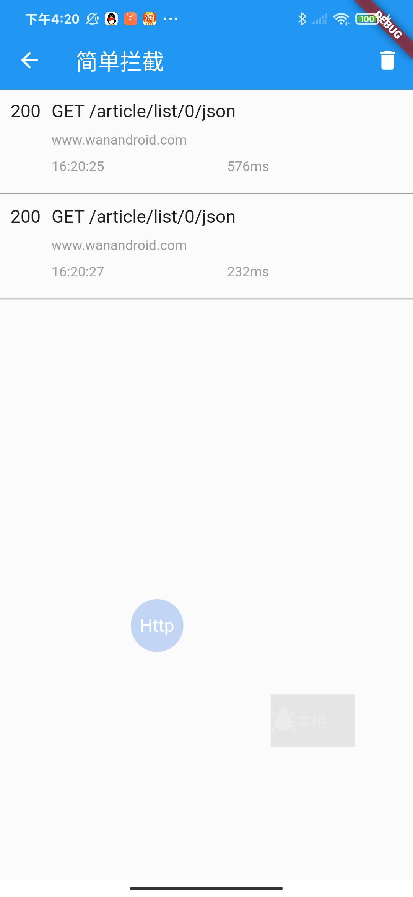
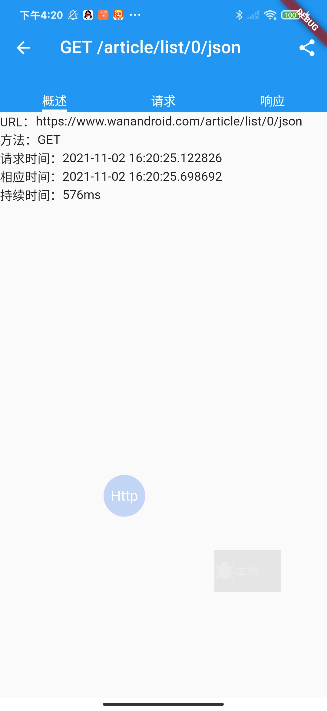
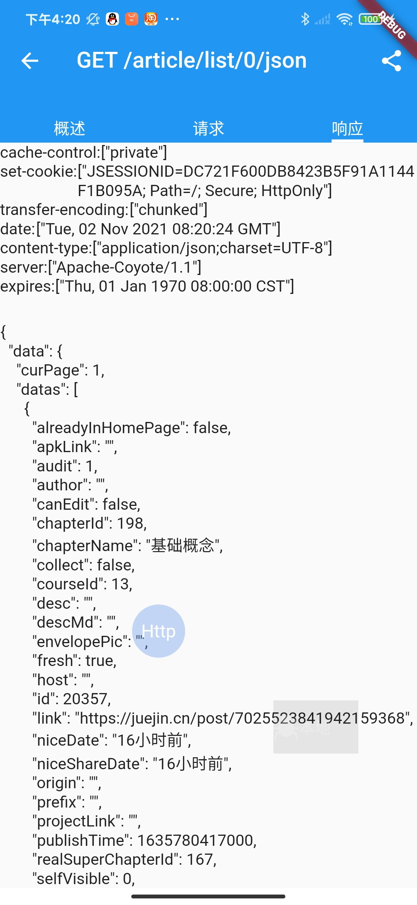
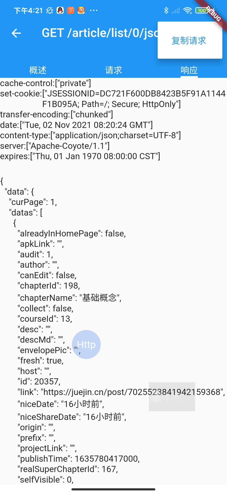

# flutter_interceptor

flutter dio interceptor

## Getting Started

```dart
dependencies:
  flutter_interceptor: ^0.0.1
```

dio add interceptor

```dart
_dio.interceptors.add(UiNetInterceptor())
```

Page insert floating form

```dart
Overlay.of(context)?.insert(InterceptorDraggable());
```

Function introduction:

1. Request visualization

2. You can copy the requested content

The effect after integration is shown in the figure










